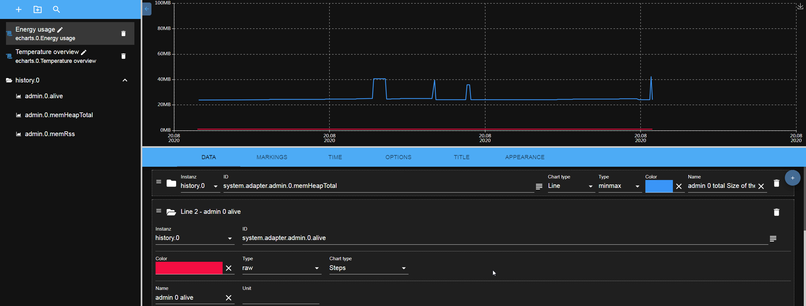
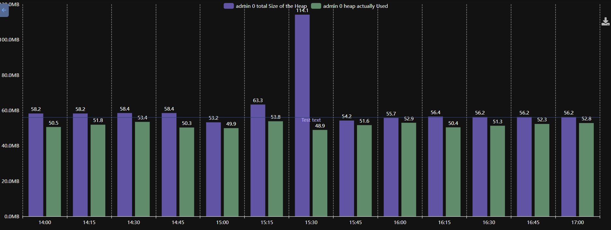
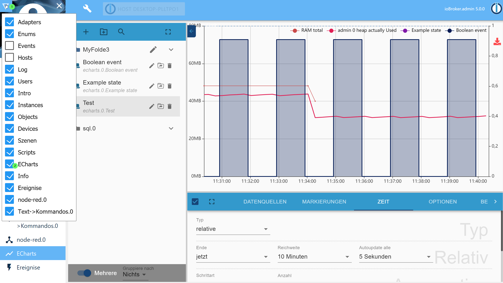
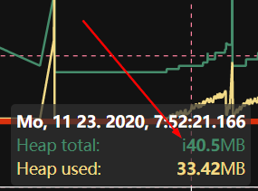

# ioBroker.echarts


[](https://www.npmjs.com/package/iobroker.echarts)


[](https://www.npmjs.com/package/iobroker.echarts)

**This adapter uses Sentry libraries to automatically report exceptions and code errors to the developers.** For more details and for information how to disable the error reporting see [Sentry-Plugin Documentation](https://github.com/ioBroker/plugin-sentry#plugin-sentry)!

## echarts adapter for ioBroker

Build useful charts in ioBroker:






Use "Actual value" aggregation for predicted result.

### One bar per data point

Normally the X-axis of a bar chart is the time and every bar is one interval. With **Bar settings → One
bar per line** the X-axis becomes the list of the lines instead: every line gets exactly one bar, which
shows the last value of that line. Together with the aggregation "Actual value" that is the current
value of every state, e.g. the consumption of every device.

**Horizontal bars** turns the chart by 90°, so the names stand on the Y-axis. That is the better choice
for long names or for many lines.

## Usage

Add after the restart the tab in the admin:


The created preset can be accessed in web adapter too. URL: `http://IP:8082/echarts/index.html?preset=echarts.0.PRESETID`.

For `vis` there is a special widget with easy selection of presets.

### Tooltip

Lower case `i` indicates that the value was interpolated from the 2-neighbour values, and it does not exist at this time stamp.



### Data from JSON

You can define the data source from JSON. In this case you can create some custom state of type `json` and store the value like this:

```json
[
    { "ts": 1675887847000, "val": 45 },
    { "ts": 1675887848000, "val": 77 },
    { "ts": 1675887849000, "val": 180 }
]
```

Alternative following attribute names are supported for `val`: `value`, `v`, `data`, `y`.
And following for `ts`: `time`, `t`, `date`.

You cannot define start and start in echarts settings. The start and end will be calculated automatically from the data.
Aggregation is not possible either. All manipulations must be done by writing of the JSON data.
The chart will be automatically updated every time the value changes.

### Server side rendering

You can render the presets on the server and get it as base64 URL or save it on disk on in ioBroker DB:

```js
sendTo(
    'echarts.0',
    {
        preset: 'echarts.0.myPreset', // the only mandatory attribute

        renderer: 'svg', // svg | png | jpg | pdf, default: svg

        width: 1024, // default 1024
        height: 300, // default 300
        background: '#000000', // Background color
        theme: 'light', // Theme type: 'light', 'dark'

        title: 'ioBroker Chart', // Title of PDF document
        quality: 0.8, // quality of JPG
        compressionLevel: 3, // Compression level of PNG
        filters: 8, // Filters of PNG (Bit combination https://github.com/Automattic/node-canvas/blob/master/types/index.d.ts#L10)

        fileOnDisk: '', // Path on disk to save the file.
        fileName: '', // Path in ioBroker DB to save the files on 'echarts.0'. E.g. if your set "chart.svg", so you can access your picture via http(s)://ip:8082/echarts.0/chart.png

        cache: 600, // Cache time for this preset in seconds, default: 0 - no cache
    },
    result => {
        if (result.error) {
            console.error(result.error);
        } else {
            console.log(result.data);
        }
    },
);
```

**Attention: You cannot enable/disable lines in legend on touch devices with enabled zoom**

## Developer manual

**For non-developers, this link does not work!**

You can debug view charts locally with:

- cd iobroker.echarts/src-chart
- npm run start
- Browser: http://localhost:8081/adapter/echarts/tab.html?dev=true

## Todo

- widget for vis (button)
- show enum icons on folders or near it
  <!--
  	Placeholder for the next version (at the beginning of the line):
  	### **WORK IN PROGRESS**
  -->

## Changelog
### **WORK IN PROGRESS**
- (@GermanBluefox) A line on a shared Y-axis shows the inherited unit in a disabled field now instead of hiding it, so it is visible where the unit comes from
- (@GermanBluefox) A line that shares the Y-axis of a line that does not exist gets an own axis now instead of stopping the whole chart
- (@GermanBluefox) The interval of the bars can be entered freely in minutes now, e.g. 90 for one and a half hours or 4320 for three days
- (@GermanBluefox) Fixed the first and the last label of a bar chart being cut off at the border: the place beside the grid is calculated from their width now
- (@GermanBluefox) The text of a marking with an upper and a lower limit is drawn only once now and not at both border lines
- (@GermanBluefox) Fixed the Y-axis being pulled back over the upper limit of a marking, which could push the marking out of the visible area
- (@GermanBluefox) A marking widens the Y-axis of its own line now and no longer always the first one of the chart
- (@GermanBluefox) Fixed the sorting of the data of a JSON source: the values were not ordered by time, so the legend showed the oldest value instead of the newest one
- (@GermanBluefox) Added "1 week" as interval for the bar charts. The bars start on Monday, like the ISO calendar week. "auto" takes it for a range of 60 days up to half a year, which used to give only a handful of monthly bars
- (@GermanBluefox) Added the calendar week to the list of the time formats, with and without the German prefix "KW"
- (@GermanBluefox) The bar interval of one month was still offered as "30 days" in the editor
- (@GermanBluefox) Fixed a chart with a static time range walking one day into the future with every update
- (@GermanBluefox) The header of the tooltip of a bar chart respects the X-label offset now, so it shows the same date as the axis below it
- (@GermanBluefox) The bar charts respect the color and the number of the X-ticks now, and their ticks are hidden together with the axis
- (@GermanBluefox) The bar charts can draw a shifted line on the main time range too, so a value that carries the time stamp of the following interval can be moved into the interval it belongs to
- (@GermanBluefox) Fixed the drawing of a shifted line with an offset in months or years: it is moved in the calendar now and does not wander away from the 1st of the month anymore
- (@GermanBluefox) Added the option to draw one bar per line instead of one bar per time interval, so the X-axis is a list of data points, e.g. the consumption of every device. The bars can lie horizontally too
- (@GermanBluefox) Fixed the aggregation "current value": it stopped the reading of the chart with an error, so the radar charts stayed empty since v2.0.0
- (@GermanBluefox) The Y-axis does not open a negative area anymore if the values are never negative
- (@GermanBluefox) Fixed the confusing date in the tooltip: it uses the date format of the language of the user now
- (@GermanBluefox) The server-side rendering formats the dates in the language of the system now and not always in English
- (@GermanBluefox) The zoom and the pan stop at the end of the time range now, so the user cannot scroll into the future by accident. It can be switched off per preset
- (@GermanBluefox) Added the option to draw a line without an entry in the legend, e.g. for a value that is only a background
- (@GermanBluefox) Fixed the server-side rendering: the actual value was missing in the legend
- (@GermanBluefox) The server-side rendering measures the axis labels with the canvas now instead of estimating them, so the charts are no longer too narrow
- (@GermanBluefox) Fixed the X-axis labels being cut off with a bigger font: the place for them is calculated from the font size now
- (@GermanBluefox) Added a second color for the values below a threshold, e.g. green while charging and red while discharging a battery
- (@GermanBluefox) Lines with the same name are shown as one entry in the legend and as one row in the tooltip now
- (@GermanBluefox) Added the option to draw a line with X-offset on the main time range, so it can be compared with the not shifted lines
- (@Brainbug01) Fixed the white screen when opening the legend or export dialog
- (@GermanBluefox) Fixed the bar charts: the values were shown one interval too late
- (@GermanBluefox) Fixed the bar charts: the months are counted in the calendar now and not as 30 days
- (@GermanBluefox) Fixed the bar charts: no additional empty bar is added at the end of the range anymore
- (@GermanBluefox) Fixed the `difference` processing of the bar charts: the first bar is not lost anymore
- (@GermanBluefox) The configured time format is used for the X-axis labels of the bar charts too

### 5.0.2 (2026-08-10)
- (@GermanBluefox) Show a state under every history instance that logs it and not only under the first one
- (@GermanBluefox) Fixed the line break in the X-axis labels for the time formats like `HH:MM / dd.mm.yy`

### 5.0.1 (2026-08-08)
- (@Brainbug01) Fixed server-side rendering hanging until the caller timed out (preview showed "timeout" for every preset)
- (@GermanBluefox) Aligned the GUI of the editor, the preview and the chart with the admin 8 design
- (@Brainbug01) Fixed creating a preset in a folder

### 5.0.0 (2026-08-03)
- (@GermanBluefox) Update to ECharts 6.1.0 and React 19

### 4.0.0 (2026-06-07)
- (copilot) Adapter requires node.js >= 22 now
- (ioBroker-Bot) Adapter requires js-controller >= 6.0.11 now.

### 3.1.2 (2026-05-28)
- (@GermanBluefox) Corrected the devices widget

## License

ioBroker.echarts is available under the Apache License V2.

Copyright (c) 2019-2026 @GermanBluefox <dogafox@gmail.com>

Apache ECharts
Copyright (c) 2017-2026 The Apache Software Foundation

This product includes software developed at
The Apache Software Foundation (https://www.apache.org/).
